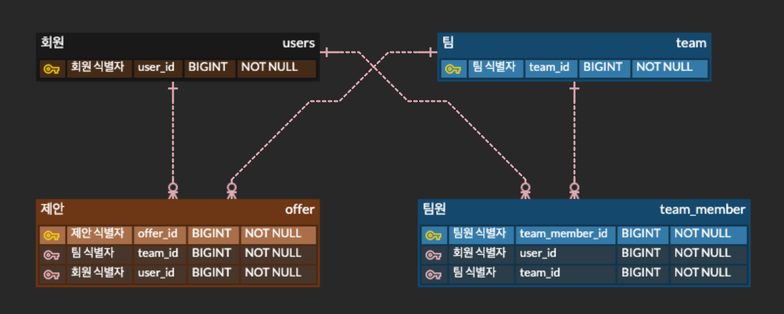
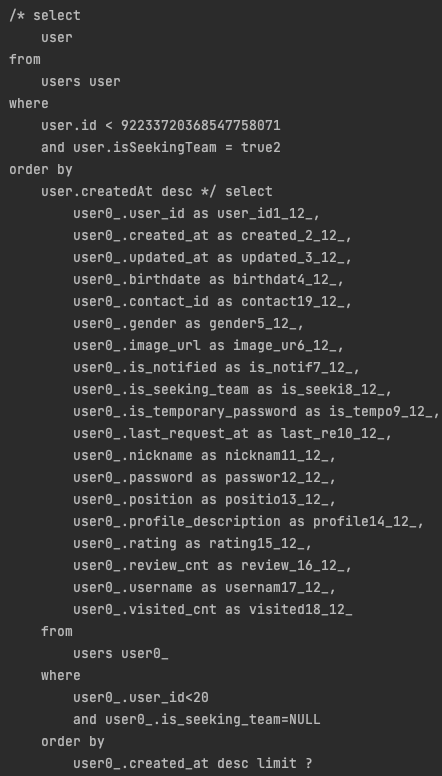
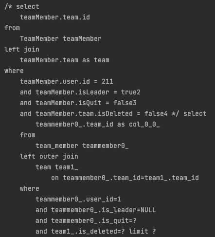
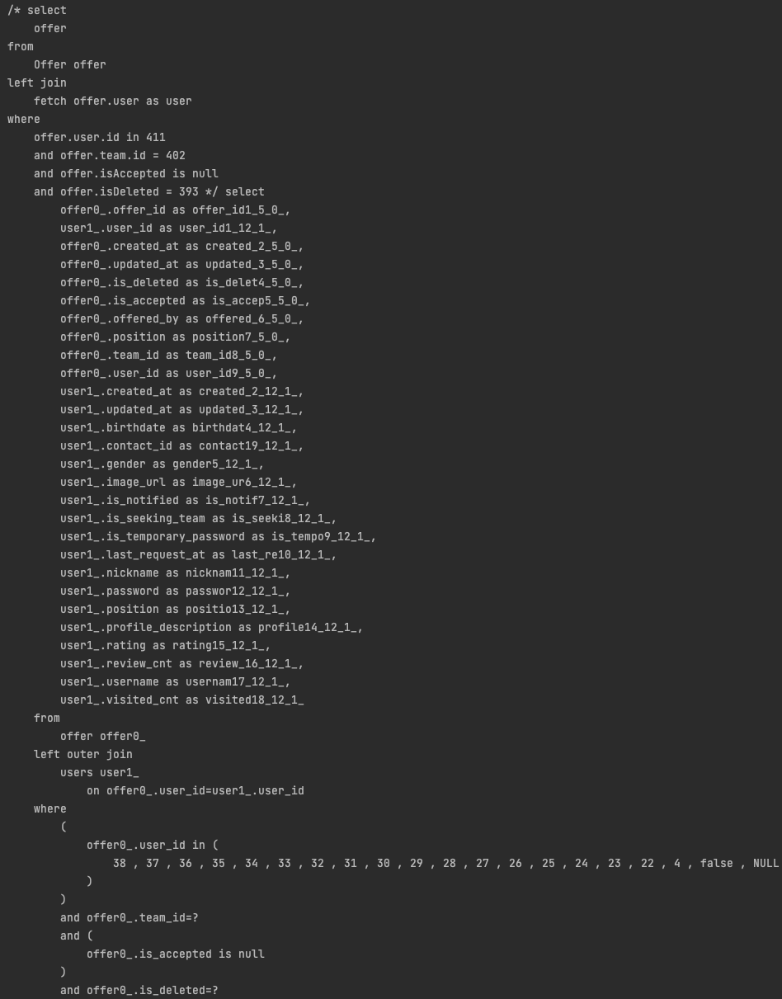

> 프로젝트에서 발생한 N+1 문제를 해결해 보겠습니다.
> 제가 진행한 프로젝트는 사이드 프로젝트를 함께할 팀원이나 팀을 찾을 수 있는 서비스입니다. 

# 개요

## N+1이란?

연관 관계가 있는 `entity A` 하나를 조회하고, 그 관계를 통해서 `entity B`를 조회할 때 query가 `entity A`의 개수만큼 일어나는 현상을 N +1이라고 합니다.

## 로직

팀을 찾고 있는 회원을 **다건 조회**하기 하는 로직입니다.



# 해결 전

기존에는 JpaRepository로 query를 하나씩 조회하는 형태로 매우 비효율적이었습니다.

1. 포지션으로 필터 해서 회원을 페이징 조회를 한다. (query 1번)
2. 조회를 하는 회원의 현재 팀원 정보를 조회한다. (query 1번)
3. 팀 리더일 경우와 아닐 경우 다른 로직을 수행한다.
   1. 팀 리더일 경우
      - step1에서 조회한 회원들에게 현재 제안 정보가 있는지 forloop을 돌며 조회한다. (query n번)
   2. 팀 리더가 아닐 경우
      - step1에서 조회한 회원들을 반환한다.

`time = 0.337초`

그래서 팀 리더인 경우 페이징 결과가 20개일 때 총 22번의 query를 날리게 되어 매우 비효율적입니다.

# 해결 후

Querydsl로 step3에서 IN 절로 성능 개선을 할 수 있습니다.

##### Repository

```java
public List<Offer> findAllByUserIds(List<Long> userIds, long offerorUserId) {
    Long teamId = queryFactory
            .select(teamMember.team.id)
            .from(teamMember)
            .leftJoin(teamMember.team, team)
            .where(
                    teamMember.user.id.eq(offerorUserId),
                    teamMember.isLeader.isTrue(),
                    teamMember.isQuit.isFalse(),
                    teamMember.team.isDeleted.isFalse()
            ).fetchFirst();

    if (teamId == null) return List.of();

    return queryFactory
            .select(offer)
            .from(offer)
            .where(
                    offer.user.id.in(userIds),
                    offer.team.id.eq(teamId),
                    offer.isAccepted.isNull(),
                    offer.isDeleted.isFalse()
            ).fetch();
}
```

##### Service

```java
public Page<ProfileOfferResponse> findPageUser(String username, Position position, long pageFrom, int pageSize) {
    User user = findUser(username);

    Page<User> users = userRepository.findPage(position, pageFrom, pageSize);

    List<Offer> offers = offerRepository.findAllByUserIds(users.stream()
                    .map(User::getId)
                    .collect(Collectors.toList()),
            user.getId());

    Map<Long, List<Offer>> oMap = offers.stream()
            .collect(Collectors.groupingBy(o -> o.getUser().getId()));
    List<ProfileOfferResponse> responses = users.stream()
            .map(u -> new ProfileOfferResponse(u, oMap.getOrDefault(u.getId(), Collections.emptyList())))
            .collect(Collectors.toList());

    return new PageImpl<>(responses, Pageable.ofSize(pageSize), users.getTotalElements());
}
```

##### Query







`time = 0.039초`

해결 전과 비교했을 때 해결 후 22번의 query를 3번의 query로 단축시킬 수 있었습니다.

# 결론

|      | 해결 전   | 해결 후   |
|------|--------|--------|
| time | 0.337초 | 0.039초 |

N+1 문제를 해결 후, 동일한 환경에서 20개의 회원 결과를 받는 로직 수행 시 **864%**의 시간 개선을 할 수 있었습니다.
