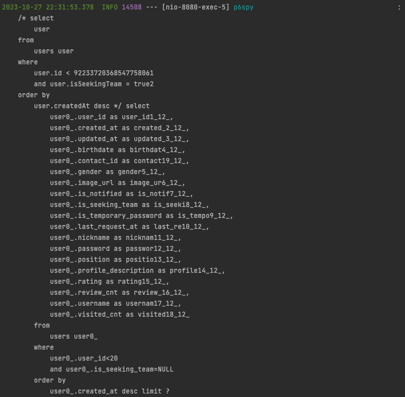
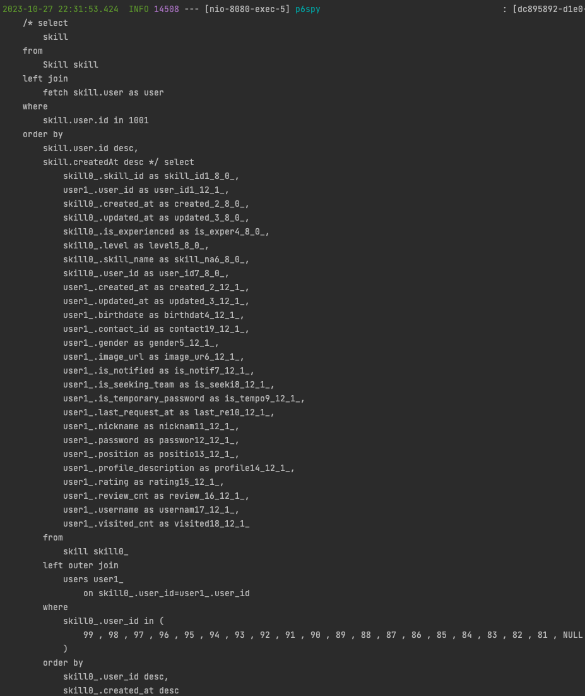
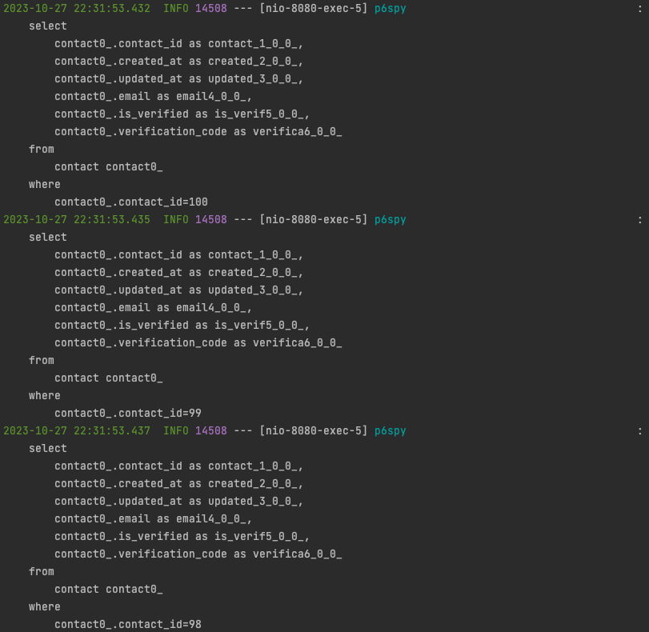
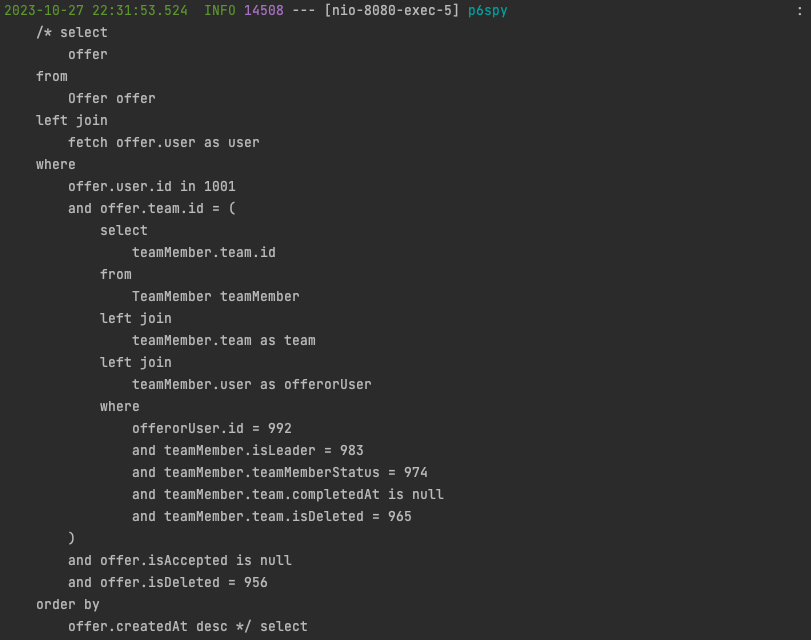
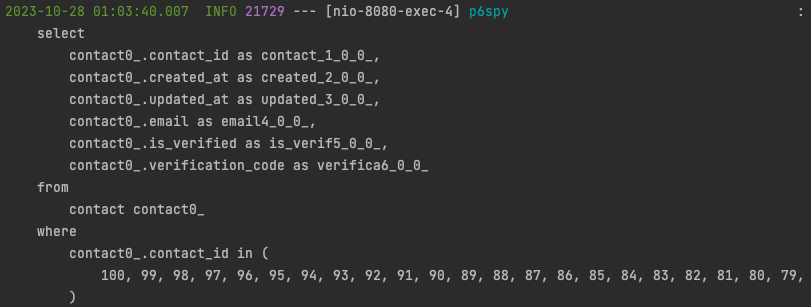

> 최근 사이드 프로젝트 '가보자IT'을 전체 리펙토링 하면서 N+1과 같은 문제를 전부 해결했습니다. 대부분 Querydsl IN 절을 통해서 해결했습니다. 하지만 성능 
> 테스트를 하다가 다시 한번 N+1 문제가 일어나는 것을 목격했습니다.

# 개요

## OneToOne 관계

프로젝트에서 하나의 이메일당 한개의 계정을 생성할 수 있는 요구사항이 있습니다. 이때 회원은 여러 개의 이메일과 관계를 가질 필요가 없기에 OneToOne 관계를 
가집니다.

##### User

```java
@Getter
@Entity(name = "users")
@NoArgsConstructor(access = AccessLevel.PROTECTED)
public class User extends BaseEntity implements UserDetails {

    @Id
    @GeneratedValue(strategy = GenerationType.IDENTITY)
    @Column(name = "user_id")
    private Long id;

    @OneToOne(fetch = FetchType.LAZY, cascade = CascadeType.REMOVE, orphanRemoval = true)
    @JoinColumn(name = "contact_id", nullable = false)
    private Contact contact;
    
    // ...
}
```

# 문제

## 발생 구간

팀을 찾는 회원 페이징 조회 API에서 문제가 발생하였습니다.

### 로직

1. 회원을 먼저 페이징 조회를 한다.
2. 조회된 회원들의 식별자로 해당 회원들의 기술들을 조회 한다.
3. 조회된 회원들에게 이미 보낸 또는 받은 제안들을 조회 한다.
4. Map을 사용해서 회원과 관련된 기술과 제안들을 매핑하여 반환한다.

##### ProfileService

```java
@Service
@RequiredArgsConstructor
@Transactional(readOnly = true)
public class ProfileService {

    // ...
    
    /**
     * 프로필 페이징 조회 |
     * 404(USER_NOT_FOUND)
     * @param username 회원 아이디
     * @param position 포지션
     * @param pageFrom 페이지 시작점
     * @param pageSize 페이지 크기
     * @return 프로필 제안 응답들
     */
    public PageData<List<ProfileOfferResponse>> findPageUser(String username, Position position, long pageFrom, int pageSize) {
        User user = findUser(username);

        Page<User> users = userRepository.findPage(position, pageFrom, pageSize);
        List<Skill> skills = skillRepository.findAllInFetchUser(users.stream()
                .map(User::getId)
                .collect(Collectors.toList()));
        List<Offer> offers = offerRepository.findAllInUserIds(users.stream()
                        .map(User::getId)
                        .collect(Collectors.toList()),
                user.getId());

        Map<Long, List<Skill>> sMap = skills.stream()
                .collect(Collectors.groupingBy(s -> s.getUser().getId()));
        Map<Long, List<Offer>> oMap = offers.stream()
                .collect(Collectors.groupingBy(o -> o.getUser().getId()));

        List<ProfileOfferResponse> responses = users.stream()
                .map(u ->
                        new ProfileOfferResponse(u,
                                sMap.getOrDefault(u.getId(), Collections.emptyList()),
                                oMap.getOrDefault(u.getId(), Collections.emptyList())))
                .collect(Collectors.toList());

        return new PageData<>(responses, users.getTotalElements());
    }
    
    // ...
}
```

N+1 문제가 생기지 않게 IN절을 적극적으로 활용했습니다. IN절로 N+1을 해결하는 방법이 궁금하시다면 해당 글을 참고해주세요. 
[IN절로 N+1 문제 해결](https://gs97ahn.github.io/posts/IN-%EC%A0%88%EB%A1%9C-N-1-%EB%AC%B8%EC%A0%9C-%ED%95%B4%EA%B2%B0/)
 
### 로그

이제 로그를 확인해보면 4번 스탭에서 N+1이 발생하는걸 확인할 수 있었습니다.

1. 페이징 조회임으로 회원 count를 하기 위한 query가 나갑니다.


2. 커서 기반으로 회원 페이징 조회 query가 나갑니다.



3. 조회된 회원들의 식별자로 해당 회원들의 기술들을 조회합니다.



4. 여기서 갑자기 조회된 회원의 수 만큼 연락처에 대한 query가 나갑니다(?)



5. 해당 회원과 관련된 제안 정보들을 조회합니다.




결과적으로 N+1 문제 해결 전에는 요청 시간이 `124ms`가 걸리는 걸 확인할 수 있습니다. 추후에 문제 해결 이후에 변화를 확인하기 위해 page-size를 50으로 
설정하였습니다. 


## 원인

```java
@OneToOne(fetch = FetchType.LAZY)
```

`@OneToOne`의 기본 `FetchType`은 `EAGER`입니다. `FetchType`을 그대로 유지 했을때 추후에 여러 문제가 발생할 수 있다고 생각해서 `LAZY`로 바꿔
뒀습니다. 그리고 `LAZY`이기 때문에 `contact`에 대한 조회가 발생하지 않으면 query가 발생하지 않을것이라 생각했던것이 틀렸습니다.

그리고 현재까지 **600개가 넘는 테스트 케이스**를 작성했음에도 불구하고 이런 문제를 발견하지 못했습니다. 그 이유는 다음과 같습니다.

1. 페이징 조회 테스트를 할때 작은 데이터로만 테스트를 했습니다.
2. 테스트 시점에서 로그를 확인할때 IN절이 제대로 동작하고 내가 신경 쓰고 있는 부분만 집중적으로 확인했습니다.

# 해결

## default_batch_fetch_size

가장 쉽게 해결하는 방법은 `default_batch_fetch_size`를 활용하는 방법입니다.

이는 `application.yml` 또는 `application.properties`에 다음과 같이 추가를 해주면 됩니다.

##### application.yml

```yml
spring:
  jpa:
    properties:
      hibernate:
        default_batch_fetch_size: 100
```

##### application.properties

```properties
spring.jpa.properties.hibernate.default_batch_fetch_size: 100
```

값은 서버의 스팩과 환경에 따라 작게는 `100`에서 크게는 `1000`으로 주는것이 가장 좋습니다. 저는 프로젝트를 위해 AWS Free Tier를 활용하기 때문에 100으로 
줬습니다.

그럼 기존에 문제가 되는 query가 대폭 축소된것을 확인할 수 있습니다.



그래서 결과적으로 요청 시간이 기존에 `124ms`에서  `54ms`로 줄여 성능 개선을 할 수 있었습니다.


## OneToOne에서 ManyToOne으로 변경

기존에 문제가 발생한 이유는 `@OneToOne`이 가지고 있는 특성 때문에 발생하기에 이를 `@ManyToOne`으로 변경해주면 문제가 해결됩니다. 하지만 저는 이 방법을
택하지 않기로 했습니다. 기존에 회원이 한개 이상의 연락처와 관계가 있을 경우가 없고, 기존에 회원이 연락처를 새롭게 인증하고 갱신한다고 해도 문제가 없기 때문입니다.

# 결론

OneToOne에서 발생하는 N+1 문제는 다음과 같이 해결할 수 있습니다.
1. default_batch_fetch_size
2. OneToOne에서 ManyToOne으로 변경

|      | 해결 전  | 해결 후 |
|------|-------|------|
| time | 124ms | 54ms |

N+1 문제를 해결 후, 동일한 환경에서 50개의 회원 결과를 받는 로직 수행 시 `230%`의 시간 개선을 할 수 있었습니다.
