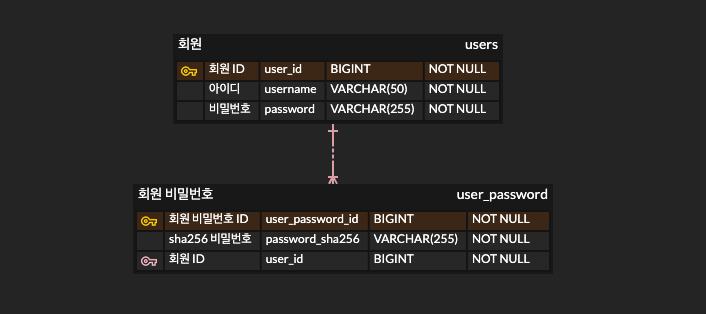

# 개요

암호화 종류는 크게 단방향과 양방향으로 나뉜다.

양방향은 암호화 한 다음 다시 평문으로 복구가 가능한 암호화 방식이고, 단방향은 암호화 한 뒤 다음 다시 평문으로 복구가 불가능하다.

그래서 ISMS 같은 보안 인증을 받을때 비밀번호와 같은 민감한 개인정보는 무조건 단방향 암호화 대상이다.

그럼 이제 무중단 서비스에서 SHA256으로 데이터마이그레이션 해보자.

ERD는 다음과 같다하고 예시를 들겠다.



# 실행 계획 📃

쿼리를 짤때 실행 계획을 철저하게 세우지 않으면 실수하기 마련이다.

테스트는 크게 쿼리 실행 전과 쿼리 실행 후로 나눈다. 쿼리 실행 전에는 특정 데이터에만 테스트를 해보며 정상적으로 마이그레이션이 되는지 확인해야 된다. 

그리고 본 쿼리를 실행 시킨 뒤에 데이터가 정상적으로 마이그레이션 됐는지 확인하고 서비스에 이상이 없는지 auth 서버 로그와 DB에 데이터들을 확인해야 된다.

예를 들어 테스트를 할 수 있는 데이터가 20개라고 할때, 10개는 쿼리 실행 전에 `IN`절을 통해 실행 시켜보고 확인한다. 그 후 나머지 10개는 본 쿼리를 실행시키고 다시 한번 확인하는 용도로 사용한다.

테스트 ID가 총 10개(ID = 1 ~ 10)이라 하자.

# 실행 전 테스트 🧐

##### 1️⃣ 테스트 대상 확인

```sql
SELECT u.user_id, u.username, u.password, up.user_password_id, up.password_sha256  
FROM users u  
LEFT JOIN user_password up ON up.user_id = u.user_id  
WHERE up.user_password_id IS NULL AND  
    u.user_id IN (1, 2, 3, 4, 5);
```


##### 2️⃣ 테스트 대상 쿼리 실행

```sql
INSERT INTO user_password(user_id, password_sha256)  
(  
    SELECT u.user_id, SHA2(u.password, 256)  
    FROM users u  
    LEFT JOIN user_password up ON up.user_id = u.user_id  
    WHERE up.user_id IS NULL AND  
       u.user_id IN (1, 2, 3, 4, 5)  
);
```

##### 3️⃣ 테스트 데이터 DB로 확인

```sql
SELECT u.user_id, u.username, u.password, up.user_password_id, up.password_sha256  
FROM users u  
LEFT JOIN user_password up ON up.user_id = u.user_id  
WHERE u.user_id IN (1, 2, 3, 4, 5);
```


##### 4️⃣ 테스트 데이터 서비스로 확인

실제 앱 또는 웹에서 마이그레이션이 잘되서 정상 작동하는지 확인하는 단계다.

# 본 쿼리 실행 🛠️

##### 1️⃣ 적용 대상 카운트

```sql
SELECT COUNT(u.id)
FROM users u
LEFT JOIN user_password up ON up.user_id = u.user_id
WHERE up.id IS NULL;
```


##### 2️⃣ 쿼리 실행 후 확인용 데이터 점검

```sql
SELECT u.user_id, u.username, u.password, up.user_password_id, up.password_sha256  
FROM users u  
LEFT JOIN user_password up ON up.user_id = u.user_id  
WHERE up.user_password_id IS NULL AND  
    u.user_id IN (6, 7, 8, 9, 10);
```


##### 3️⃣ 마이그레이션 쿼리 실행

```sql
INSERT INTO user_password(user_id, password_sha256)  
(  
    SELECT u.user_id, SHA2(u.password, 256)  
    FROM users u  
    LEFT JOIN user_password up ON up.user_id = u.user_id  
    WHERE up.user_id IS NULL 
);
```

# 실행 후 확인 🧐

##### 1️⃣ 실행 후 확인용 데이터 DB로 확인

```sql
SELECT u.user_id, u.username, u.password, up.user_password_id, up.password_sha256  
FROM users u  
LEFT JOIN user_password up ON up.user_id = u.user_id  
WHERE u.user_id IN (6, 7, 8, 9, 10);
```


##### 2️⃣ 실행 후 확인용 데이터 서비스로 확인

# 마무리

Batch를 사용하지 않아도 쿼리만으로도 SHA256으로 데이터를 암호화하고 마이그레이션 진행할 수 있다.

# 참조

- https://helloworld.kurly.com/blog/distributed-redisson-lock/